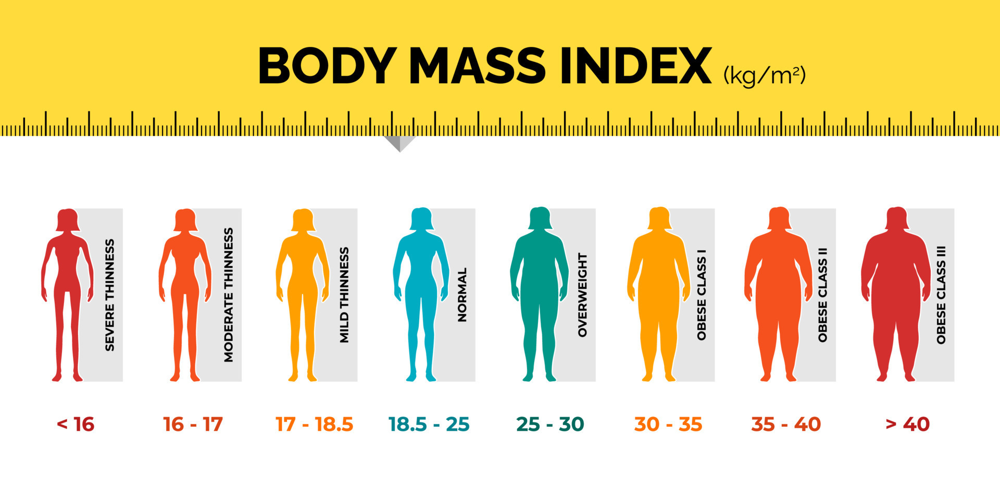

# BMI Calculator - Python Project #1

This project builds a simple **web application** for calculating Body Mass Index (BMI) using: 
- **Python** : create application syntax 
- **Pandas** : create information table 
- **Streamlit** : create *web application* in the format of GUI-friendly

## Features

* **User-friendly interface:** Streamlit provides an intuitive way to create interactive web applications.
* **Input validation:** Ensures valid input ranges for height and weight.
* **BMI calculation:** Calculates BMI based on user input.
* **BMI interpretation:** Categorizes BMI into different weight categories (e.g., underweight, overweight, obese).
* **Reference table:** Displays a table of BMI categories for reference.

## Getting Started

1. **Install required libraries**
   ```bash
   pip install streamlit pandas

2. **Run The Application**
    ```bash
    streamlit run app.py

3. **Access the application**
   ```bash
   Open your web browser and navigate to the provided URL (usually http://localhost:8501/).

## How it works

1. User input: The user enters their height in centimeters and weight in kilograms.
2. BMI calculation: The BMI() function calculates the BMI using the standard formula.
3. BMI interpretation: The function categorizes the calculated BMI into different weight categories.
4. Output: The application displays the user's height, weight, calculated BMI, and the corresponding weight category.
5. Reference table: A table of BMI categories is displayed for further reference.

## Project Organization

The directory structure of IndoMarket project looks like this:

    ├── README.md               <- Overview of this project
    │
    ├── webapp_main.py          <- Main code to run GUI or web application of this project
    │
    ├── python_script.py        <- Code to run application without GUI
    │
    ├── documentations.ipynb    <- Detailed code and wxplanations of every syntax                     

## Contribute

Contributions are welcome! Please feel free to submit a pull request or open an issue on GitHub.
